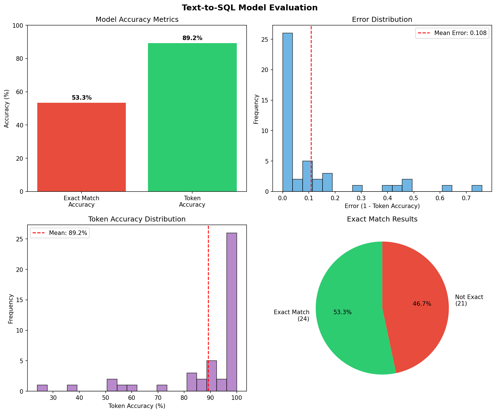

# Text-to-SQL Generator

A model that converts plain English questions into SQL queries.

## About This Project

I built this project to learn fine-tuning after completing Ed Donner's LLM Engineering course (Week 6).

The idea is simple - you type a question like "Show all customers from New York" and the model gives you the SQL: `SELECT * FROM customers WHERE city = 'New York'`

## What I Did

1. Downloaded 262,208 examples from Hugging Face
2. Cleaned the data - removed stuff that was too long or too short
3. Balanced it so I have equal examples of different query types (SELECT, JOIN, GROUP BY, etc.)
4. Ended up with 255 training examples and 45 test examples
5. Fine-tuned GPT-4o-mini for 3 epochs
6. Built a simple web UI with Gradio

## Results

Got 53% exact match and 89% token accuracy. Not perfect but pretty good for only 255 training examples!

| Metric | Score |
|--------|-------|
| Exact Match | 53.3% |
| Token Accuracy | 89.2% |



## How to Run

```bash
pip install -r requirements.txt

# Add your OpenAI key
echo "OPENAI_API_KEY=your-key" > .env

# Run these in order
python curate_data.py    # Get the data
python fine_tune.py      # Train the model (takes ~15 min)
python check_status.py   # Check if done
python evaluate.py       # See the results
python app.py            # Try it out!
```

## Files

- `curate_data.py` - Downloads and cleans data
- `fine_tune.py` - Does the fine-tuning
- `evaluate.py` - Tests the model and makes charts
- `app.py` - Web interface

## What I Learned

- How to get data from Hugging Face and clean it up
- What fine-tuning actually does (basically teaching the model a specific skill)
- What epochs are (how many times model sees the training data)
- How to check if a model is good using metrics
- How to make a simple web app with Gradio

## Tools

- Python
- OpenAI API
- Hugging Face datasets
- Gradio
- Matplotlib

---

Built while learning from Ed Donner's LLM Engineering Course
